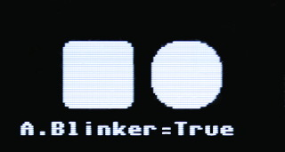

# RoboEyes library for MicroPython

Once upon a time, I browsed the internet and discovered the [RoboEyes video from FluxGarage](https://www.youtube.com/playlist?list=PLD2oXF44y-hLKjw_es2Vw1ycwBRNZ6ceE) on YouTube.

](docs/_static/roboeyes-01.jpg)


RoboEyes is open source library draws smoothly animated robot eyes on OLED displays (using the GFX library). It offers configurable eye shapes, several mood types and animations to add that certain kind of personality to your robot.

](docs/_static/roboeyes-00.jpg)


The eyes was so lovely but unfortunately, the [library was written for Arduino Uno](https://github.com/FluxGarage/RoboEyes) by [FluxGarage](https://www.fluxgarage.com/index.php) and I'm a MicroPython addict.

__This library is a MicroPython portage of RoboEyes for Arduino__. 

Some enhancement was added into the library like:

* Based on MicroPython's FrameBuffer (so __works with 99% of displays__)
* Monochrome and color displays! 1 bit color by default (for OLED).
* Adding FROZEN, SCARY, CURIOUS moods to the exising DEFAULT, TIRED, ANGRY, HAPPY.
* Adding the wink() animation.
* Managing animation sequence (see [test_anim_sequence.py](examples/test_anim_sequence.py) ).

# Library 

The RoboEyes library and its dependencies must be copied to the MicroPython board before using the examples.

Dependencies are:

* GFX library for MicroPython
* Display driver (SSD1306 for most of OLED screen)

On a WiFi based plateform:
```
>>> import mip
>>> mip.install("github:mchobby/micropython-roboeyes")
>>> mip.install("github:mchobby/esp8266-upy/FBGFX")
```

Or via the `mpremote` utility:
```
mpremote mip install github:mchobby/micropython-roboeyes
mpremote mip install github:mchobby/esp8266-upy/FBGFX
```

The SSD1306 library is available in the official MicroPython repository. You can download it into and transfert it to your MicroPython board. 

Here the instruction used in [install.sh](install.sh) bash script.

```
$ wget https://raw.githubusercontent.com/micropython/micropython-lib/refs/heads/master/micropython/drivers/display/ssd1306/ssd1306.py -O lib/ssd1306.py
$ mpremote connect $1 fs cp lib/ssd1306.py :lib/
```


# Wiring 
As said, this FrameBuffer implementation of RoboEyes should work with any display (OLED, RGB, etc).

## Wiring to I2C OLED
Qwiic (SparFun) or StemmaQt (Adafruit Industries) is a standardized 4 pins connector shipping I2C bus (sda, scl) as well as power and ground.

Here a wiring via a [Qwiic-to-wire cable](https://shop.mchobby.be/fr/jst-sh/2429-cable-jst-sh-4-poles-vers-broches-males-150mm-stemma-qt-qwiic-3232100024298-adafruit.html) used for prototyping. The OLED screen used is the [Adafruit 128x64 OLED display - 1.3" Monochrome - I2C - StemmaQT / Qwiic](https://shop.mchobby.be/fr/afficheur-lcd-tft-oled/307-afficheur-oled-128x64-13-monochrome-i2c-stemmaqt-qwiic-3232100003071-adafruit.html)


The OLED can be directly plugged with [qwiic wire](https://shop.mchobby.be/fr/jst-sh/2112-cable-jst-sh-4-poles-100mm-stemma-qt-qwiic-3232100021129-adafruit.html) on a microcontroler/board exposing a Qwiic connector.


# API

The RoboEyes API is described in the [MicroPython-RoboEyes-API.md](MicroPython-RoboEyes-API.md) document

# Examples

The best way to learn how to use the RoboEyes is to read the examples below then read the [RoboEye API](MicroPython-RoboEyes-API.md) to understand the responsabilities of various calls.

## The basic example

This [YouTube Video](https://youtu.be/Ma5l_pvi8W8) show the micropython-RoboEyes in action.

This correspond to minimalist implementation of [test_basic.py](examples/test_basic.py) visible here below:

``` python
from machine import I2C, Pin
from roboeyes import *
import ssd1306

i2c = I2C( 1, sda=Pin.board.GP6, scl=Pin.board.GP7 )
lcd = ssd1306.SSD1306_I2C( 128, 64, i2c, addr=0x3d )

def robo_show( roboeyes ):
	global lcd
	lcd.show()

# Plug RoboEyes on any FrameBuffer descendant
robo = RoboEyes( lcd, 128, 64, frame_rate=100, on_show = robo_show )
robo.set_auto_blinker( ON, 3, 2) 
robo.set_idle_mode( ON, 2, 2) 

while True:
	robo.update()  # update eyes drawings 
```

## Interactive examples

When the [test_basic.py](examples/test_basic.py) runs on your hardware then you can switch to the [test_interactive.py](examples/test_interactive.py) example.

In that example, the script takes advantage of FrameBuffer capabilities by overlaying questions and configuration messages before displaying screen content.

The [test_interactive.py](examples/test_interactive.py) example uses 3 buttons to control the behavious of the running RoboEye.


Thanks to the buttons, the user can __select the option__ with question mark. Then __modify the value__ with the equal sign.

__The question mark:__

The interactive example shows one of the options followed by a __question mark__ at the bottom on the screen.


The possible actions are:

* Press '__Enter__/Exit' button to enter the option (and change its value)
* Press '+' button for next option.
* Press '-' button for previous option.

Remark: the list of option will automatically cycle to opposite end when reaching the end+1 (or begining-1) position.

__The value setting:__

When an option is selected, the option label is shorten and the current value is displayed behind an __equal sign__ .



The possible actions are:

* Press '+' button for next value.
* Press '-' button for previous value.
* Press 'Enter/__Exit__' button to return to the option selection.

Notes:

* value change is immediately applied to the running RoboEye.
* Numerical values are not bounded.

In the example below, the screen update the "Right Eye Width" value:


__The options:__

The possible options (and short label) are the following:

* __Auto Blinker?__ (_A.Blinker_) : automatically blink the eyes.
* __Auto Idle?__ (_A.Idle_) : automatically move the eyes.
* __Eyes Width?__ (_Eyes.W_)
* __Eyes Height?__ (_Eyes.H_)
* __Eyes Radius?__ (_Eyes.r_)
* __Eyes Spacing?__ (_Eyes.Sp_)  
* __Cyclops mode?__ (_Cyclops_)
* __Select Mood?__ (_Mood_) : Curious mood only activates visual effect when eyes are on the right or left border.
* __Position?__ (_Position_)
* __Confuse & Laugh?__ ( _(-)Conf (+)Laugh_ ) : better to deactivate auto-blink and auto-idle to test theses. Laugh gives better result with Happy mood.
* __Wink?__ ( _(-)Left (+)Right_ ) : better to deactivate auto-blink to test theses. 
* __Close & Open?__ ( _(-)Close (+)Open_ ) : better to deactivate auto-blink to test theses. 
* __Horiz flicker?__ (_H.flicker_) : better to deactivate auto-idle to test theses. 
* __Vert flicker?__ (_V.flicker_) : better to deactivate auto-blink to test theses. 
* __Left Eye Width?__ (_L.Eye.W_)
* __Left Eye Height?__ (_L.Eye.H_)
* __Left Eye Radius?__ (_L.Eye.r_)
* __Right Eye Width?__ (_R.Eye.W_)
* __Right Eye Heigh?__ (_R.Eye.H_)
* __Right Eye Radiu?__ (_R.Eye.r_)


## List of examples

The repository comes with examples ported from Flux garage. Examples are mainly tested on 128x64 I2C capable OLED.

* [test_basic.py](examples/test_basic.py) : Simple script that can be used to test each features, one at the time.
* [test_color.py](examples/test_color.py) : show how to define colors when creating RoboEyes object.
* [test_anim_sequence.py](examples/test_anim_sequence.py) : create animation sequence without using delay.
* [test_interactive.py](examples/test_interactive.py) : change the RoboEyes parameters in a live sessions.

Other examples:

* [test_round.py](examples/test_round.py) : create round eyes with negative spacing.
* [test_cyclops.py](examples/test_cyclops.py) : create a square cyclops eye.